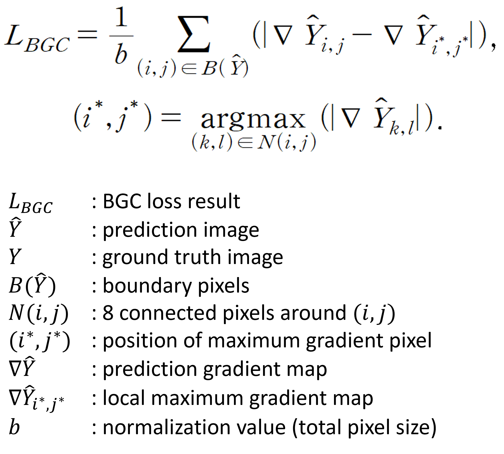
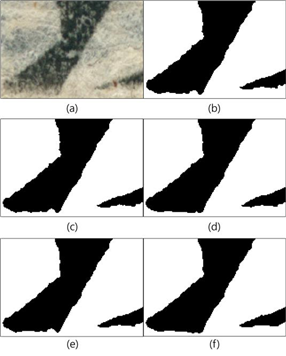
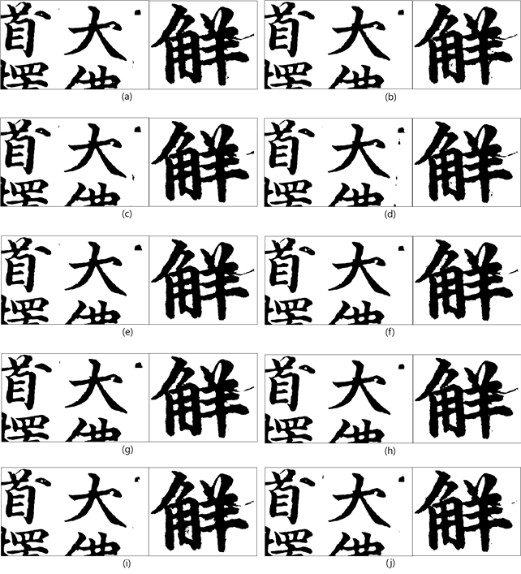

## Boundary Gradient Consistency Loss

Paper : Improvement of a Segmentation Network for Character Stroke Extraction from Metal Movable Type Printed Documents

DOI   : https://doi.org/10.5573/ieie.2023.60.12.31

This loss function is designed to encourage smooth and consistent boundaries of the foreground
 (especially text regions) in segmentation tasks.
Since it only takes logits (predictions) as input, it should be used together with
 other loss functions during training.

In our experiments, the best performance was achieved when this loss was combined with
 Dice coefficient loss on old printed book datasets scanned at 600 dpi.

When the input resolution is too high, this loss tends to over-focus on details.
To mitigate this, max pooling is applied before computing the boundary gradients.
Therefore, the pooling scale should be adjusted according to the resolution of the input images.

Although average pooling or Gaussian blur can also be used, additional preprocessing steps
 (e.g., quantization or contour extraction) are required to compute boundary gradients properly.

## Dataset

Figure: (a) Input image, 
(a1) Outer line, 
(a2) Saperating line(Vertical), 
(b) Combo loss (Dice coefficient loss + Cross entropy loss) Result

The dataset we used is scanned Korean old printed book (16-17th century).
Previous model with combo loss cannot erase (a1) and (a2) well.

## Loss function

Orange pixel: anchor pixel
1. Search grey neighbor pixels like N(I,j), and get their gradient.
2. Find position of maximum gradient magnitude with argmax.
3. Compare between anchor gradient and the others.
4. If, anchor pixel gradient is similar to others it means smooth stroke, than loss value goes down.
This method lead stroke smoother.

## Results by pooling parameter

Figure: (a) Input, 
(b) Dice + BGC(1), 
(c) Dice + BGC(2), 
(d) Dice + BGC(4), 
(e) Dice + BGC(8), 
(f) Dice + BGC(16)

Results with various loss functions

Figure: (a) Cross Entropy, 
(b) Dice, 
(c) Dice + Total Variation, 
(d) Dice + Cross Entropy, 
(e) Cross Entropy + Focal, 
(f) Dice + Focal, 
(g) Dice + Gradient Difference
(h) Dice + Cross Entropy + Total Variation
(i) Dice + Cross Entropy + Total Variation + Focal
(j) Dice + BGC(16) (proposed)
